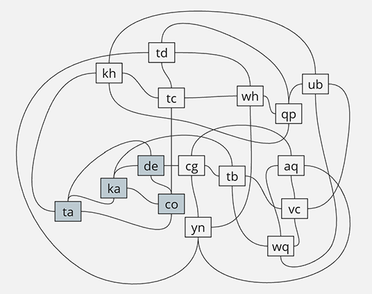

# Solutions to Day 23: LAN Party

*For the puzzle description, see [Advent of Code 2024 - Day 23](https://adventofcode.com/2024/day/23).*

Here are my solutions to the puzzles of today. Written chronologically so you can follow both my code and line of thought.

## Part 1

Today, again this wasn't a super hard puzzle. A bit of brain yoga, but manageable. I created a `Computer` class that holds both a name, and a list of (other) computer objects to store all connections to that individual computer. Then, created a `Dictionary<string, Computer>` collection to store those computers in, where I also use the computer names as an index for easy reference. Then I've looped over the input, and everytime I encountered a new computer I didn't have in my dictionary yet, I created a new instance of the computer class and added it to the list. Also, for each line, I then added the connections in both ways to the corresponding objects. Because of the dictionary I can easily refer to the corresponding object based on the name used in the input. This input shaping is always very important to me, as it helps tremendously in solving the puzzle.

Then I've created a `HashSet<string>` collection to store all sets in that I find. Because I am looping over all individual computers, I will find a group of three connected computers from the perspective of each one of those. I could build some logic to check that, but using a `HashSet` is way easier: I just add each group I find and it will only be added if it isn't in the list already, automatically deduplicating my list. This works because the computers names in each list will have to be sorted before adding anyway.

Now, I start looping over all computers, and for each computer over all its connections, and for each connection over all its connections (the second grade connections). Then for each second grade connection I check if it's connected to both the current computer, and its current connection I'm checking (so the first pair), and also, if any of these three names start with a `t`. If So, I have found a set of three, create a list of names, sort that, and add it to my set collection.

The answer now simply is the amount of items in my `HashSet<string>` collection `sets`.

## Part 2

The second part is where it gets a little bit more challenging. With this kind of challenges, it also helps greatly to create a visualization of the input to get a better understanding of the data structure at hand, so I drew up a graph of the example input:

The colored nodes are the set they're looking for.

What I thought when seeing this, is: let's find all nodes that have mutual connections with the current node I'm analyzing (a bit like part 1), and all add them to a list. Now, every node in that list should be connected to all other nodes in that list to be a valid network of all interconnected computers. Then, I simply remove all computers from the list that do not meet that condition, and I should have my answer.

Because it's a little more nested and elaborate datastructure, but doesn't need recursion at all (you could use recursion for this, but it's more expensive actually I think, whenever I can cope without I will prefer that over expensive DFS algorithms), I have split the functionality in separate functions for clarity. 

The first function is named `findMutualConnections()` and it does exactly that. A bit like with part 1, I loop over the connections of a computer and than for each connection over its connections (the second grade connections). Now, for each second grade connection, I check if it's also connected with the computer I am currently analyzing, and if so, I've found a group of three and add both the first and second grade connections to my list of plausible names of computers that could make up my network. I again use a `HashSet<string>` collection to automatically get rid of any duplicates (which will occur a lot at this stage using this approach).

The second function is named `removeComputersThatAreNotConnectedToAllOthers()`, a bit long, but I like that it exactly describes what it does. It uses the output of the first function as its input, and then for each computer name in the list, it checks if that's connected with all other computers in that same list. Every computer that does not meet this condition is added to a `toRemove` list, and later on removed from the list itself. We have to do it like this because you can't (and don't want to) alter a list you're currently iterating over.

The third function `setAnswer()` then sorts this list of computer names (if it's not empty) and creates the comma separated string representation. If the string length is longer than the previous answer I've found, I override the answer with this new one. Checking on string length works because all computer names are of the same length, so I do not also have to keep the computer count per list of found networks.

And that's all there is to it actually. I kind of like my approach of first collecting candidates and later sorting them out, makes it a lot less complicated than adding computers while checking, maybe also having to involve recursion.

